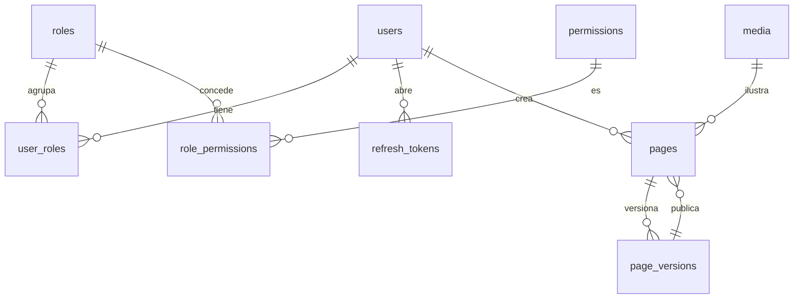

# 03 · Modelo de datos

## Convenciones que aplican a toda tabla

| Regla | Detalle |
|---|---|
| Nombres | `snake_case`, tabla en plural (`pages`, `page_versions`) |
| Llave | `uuid` v7 generado en Go, no `serial`. Un id secuencial filtra volumen de negocio y estorba al fusionar bases |
| Tiempos | `timestamptz` siempre. Nunca `timestamp` sin zona |
| Auditoría | `created_at`, `created_by`, `updated_at`, `updated_by` en toda tabla de negocio. Los llena `platform/audit`, no el código de negocio |
| Enumerados | `text` **con `CHECK`**. Sin el `CHECK`, la constante de Go y la base se desincronizan en silencio |
| Borrado | Real por omisión. `deleted_at` solo donde el negocio pide recuperar, y entonces **todo** índice único lleva `where deleted_at is null` |
| Dinero | `numeric(12,2)`, jamás `float` |
| Concurrencia | `version int not null default 1` en lo que se edita concurrentemente. Ver `04-reglas-de-crud.md` |

## Identidad (`modules/identity`)

```sql
users (
  id uuid pk,
  email citext unique not null,        -- citext: comparación insensible sin lower()
  password_hash text not null,          -- argon2id
  display_name text not null,
  enabled boolean not null default true,
  created_at, created_by, updated_at, updated_by
)

roles (id uuid pk, key text unique, name text)          -- admin, staff, viewer
permissions (key text pk, description text)             -- sembrados por cada módulo
role_permissions (role_id, permission_key)              -- pk compuesta
user_roles (user_id, role_id)                           -- pk compuesta

refresh_tokens (
  id uuid pk,
  user_id uuid fk users,
  token_hash bytea not null,            -- SHA-256 del valor. NUNCA el valor
  replaced_by uuid null fk refresh_tokens,
  revoked_at timestamptz null,
  expires_at timestamptz not null,
  user_agent text, ip inet,
  created_at
)
```

Tres cosas que no son obvias:

- **`permissions` la siembran los módulos al arrancar**, desde
  `Module.Permissions()`. Una migración que inserta permisos a mano se
  desincroniza el día que se borra el módulo
- **`refresh_tokens.token_hash` es la única forma aceptable de guardarlo.** Una
  fuga de la base no debe entregar sesiones activas
- **`replaced_by` es lo que detecta el robo de un refresh.** Ver `06-flujos.md`

## Contenido: la landing editable (`modules/content`)

Este es el corazón del starter. La landing **no vive en el código**: vive en la
base y se edita desde el dashboard.

```sql
pages (
  id uuid pk,
  slug text not null,                   -- 'inicio', 'nosotros', 'precios'
  title text not null,
  seo_title text, seo_description text, seo_image_id uuid,
  published_version_id uuid null,       -- null = nunca publicada
  version int not null default 1,
  created_at, created_by, updated_at, updated_by,
  unique (slug)
)

page_versions (
  id uuid pk,
  page_id uuid fk pages on delete cascade,
  number int not null,                  -- 1, 2, 3… local a la página
  blocks jsonb not null,                -- el contenido. Ver abajo
  note text,                            -- "cambié el hero", opcional
  created_at, created_by,
  unique (page_id, number)
)
```

### Por qué versiones y no una tabla `blocks`

- **Publicar es apuntar, no mutar.** `published_version_id` cambia de valor y la
  landing entera cambia de forma atómica. No hay estado intermedio donde medio
  sitio está publicado
- **Revertir es apuntar a una versión anterior.** Sin lógica de deshacer
- **Editar no afecta lo publicado.** El borrador es "la versión mayor"; lo
  público es la apuntada. Son cosas distintas por construcción
- Una tabla `blocks` con `order` obliga a reordenar filas en cada arrastre del
  editor, y a inventar el versionado igual

### La forma de `blocks`

```json
[
  { "id": "b1", "type": "hero",     "props": { "title": "…", "imageId": "…" } },
  { "id": "b2", "type": "features", "props": { "items": [ … ] } }
]
```

Un **tipo de bloque** es dos cosas que viajan juntas:

1. Un componente Vue en `web/app/shared/blocks/<Tipo>.vue`
2. Un esquema JSON en el backend que valida sus `props`

El backend valida `props` contra el esquema del tipo **antes de guardar**. Sin
eso, `jsonb` es un basurero y el error aparece en la landing en producción, no
en el editor. El catálogo de tipos es lo que un fork edita para cambiar el
lenguaje visual del sitio.

## Medios (`modules/media`)

```sql
media (
  id uuid pk,
  sha256 bytea not null,                -- deduplicación
  mime text not null,                   -- deducido de los BYTES, no del nombre
  size_bytes bigint not null,
  width int, height int,
  original_name text,
  storage_key text not null,            -- ruta dentro de storage.Store
  created_at, created_by,
  unique (sha256)
)
```

El archivo crudo **no vive en la base**: vive detrás de `platform/storage.Store`,
con implementación local en desarrollo. La base guarda metadatos y la llave.

Deduplicar por `sha256` significa que subir dos veces la misma imagen responde
`200` con el registro existente en vez de `201`. Es una decisión de contrato,
no un detalle: ver `04-reglas-de-crud.md`.

## Configuración del sitio (`modules/settings`)

```sql
settings (
  key text pk,                          -- 'site.brand', 'site.nav', 'site.theme'
  value jsonb not null,
  version int not null default 1,
  updated_at, updated_by
)
```

Clave-valor con esquema por clave, validado como los bloques. Es donde vive lo
que el fork cambia sin tocar código: nombre, logo, colores, menú, pie, redes.

**No es un cajón de sastre.** Si algo tiene reglas propias, ciclo de vida o se
consulta con filtros, es una tabla, no un setting.

## Diagrama


