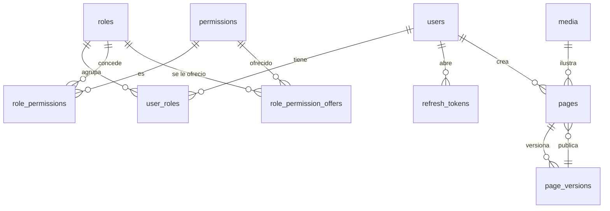

# 03 · Modelo de datos

## Convenciones que aplican a toda tabla

| Regla | Detalle |
|---|---|
| Nombres | `snake_case`, tabla en plural (`pages`, `page_versions`) |
| Llave | `uuid` v7 generado en Go, no `serial`. Un id secuencial filtra volumen de negocio y estorba al fusionar bases |
| Tiempos | `timestamptz` siempre. Nunca `timestamp` sin zona |
| Auditoría | `created_at`, `created_by`, `updated_at`, `updated_by` en toda tabla de negocio. Los llena `platform/audit`, no el código de negocio |
| Enumerados | `text` **con `CHECK`**. Sin el `CHECK`, la constante de Go y la base se desincronizan en silencio |
| Borrado | Real por omisión. `deleted_at` solo donde el negocio pide recuperar, y entonces **todo** índice único lleva `where deleted_at is null` |
| Dinero | `numeric(12,2)`, jamás `float` |
| Concurrencia | `version int not null default 1` en lo que se edita concurrentemente. Ver `04-reglas-de-crud.md` |

## Identidad (`modules/identity`)

```sql
users (
  id uuid pk,
  email citext unique not null,        -- citext: comparación insensible sin lower()
  password_hash text not null,          -- argon2id en formato PHC
  display_name text not null,
  enabled boolean not null default true,
  dev_seed boolean not null default false,  -- lo creó cmd/seed. Ver abajo
  version int not null default 1,
  created_at, created_by, updated_at, updated_by
)

roles (id uuid pk, key text unique, name text)          -- superadmin, admin, staff, viewer
permissions (
  key text pk,
  description text not null,
  sensitive boolean not null default false  -- lo marca el módulo. Ver abajo
)
role_permissions (role_id, permission_key)              -- pk compuesta, on delete cascade
role_permission_offers (role_id, permission_key)        -- lo que la siembra ya ofrecio. Ver abajo
user_roles (user_id, role_id)                           -- pk compuesta, on delete cascade

refresh_tokens (
  id uuid pk,
  user_id uuid fk users,
  token_hash bytea not null,            -- SHA-256 del valor. NUNCA el valor
  replaced_by uuid null fk refresh_tokens,
  revoked_at timestamptz null,
  expires_at timestamptz not null,
  user_agent text, ip inet,
  created_at
)
```

Los cuatro roles del starter —`superadmin`, `admin`, `staff`, `viewer`— sí los
siembra la migración, con ids fijos escritos a mano. Son contenido por omisión,
como las claves de `settings`; y el id fijo es lo que permite que un seed o una
prueba nombre el rol `superadmin` sin tener que consultarlo antes.

**`superadmin` y `admin` no son el mismo rol con otro nombre.** El primero
reparte poder —cuentas, roles, permisos—; el segundo opera el sitio. Quien puede
asignar roles puede darse a sí mismo cualquier permiso, así que si `admin`
tuviera `identity.role.assign` la separación no separaría nada.

Siete cosas que no son obvias:

- **`permissions` la siembran los módulos, no una migración.** El catálogo se
  reconcilia desde `Module.Permissions()` en `app.SeedPermissions`, pegado a las
  migraciones: alta, actualización de la descripción, y **borrado de lo que ya
  nadie declara**. Una migración que inserta permisos a mano se desincroniza el
  día que se borra el módulo, y deja roles concediendo algo que no existe
- **El rol `superadmin` recibe todo permiso declarado**, en la misma
  transacción. Sin eso, el permiso de un módulo nuevo nace inalcanzable: nadie
  lo tiene, y la pantalla para concederlo también lo exige. Sus concesiones no
  son datos editables: se reconcilian en cada despliegue
- **El rol `admin` recibe lo que ningún módulo marcó como sensible, una vez
  por permiso.** La siembra le concede lo que todavía no se le ofreció y lo
  anota en `role_permission_offers`. Quitar una concesión no toca su oferta, así
  que lo que se le quite desde el dashboard queda quitado; y el permiso de un
  módulo que llega a una instalación ya arrancada le llega igual, porque es
  nuevo. Repartirle en cada despliegue haría que lo revocado volviera solo;
  repartirle una sola vez en la vida dejaría cada módulo nuevo solo en manos del
  superadmin. Si un módulo se borra, su oferta se va por cascada con el permiso,
  y si vuelve, se ofrece otra vez
- **`Sensitive` lo decide el módulo que inventa el permiso**, en su
  `Permissions()`, porque es el único que sabe qué hace. Una lista en la siembra
  —"todo lo que empiece por `identity.`"— habría que editarla desde fuera cada
  vez que un fork agrega un dominio con operaciones delicadas propias
- **La tabla la guarda el módulo que la posee, y `app` lo descubre por
  interfaz** (`CatalogoDePermisos`), no por el nombre del paquete. Un fork que
  borre `identity` sigue compilando y simplemente no siembra nada
- **`dev_seed` marca al admin que crea `cmd/seed`.** La marca viaja en la fila,
  no en la máquina del que sembró: `Autenticar` rechaza esa cuenta cuando
  `APP_ENV` no es `dev`, así que un volcado de desarrollo copiado a otro entorno
  no trae dentro una cuenta con contraseña pública
- **`refresh_tokens.token_hash` es la única forma aceptable de guardarlo.** Una
  fuga de la base no debe entregar sesiones activas
- **`replaced_by` es lo que detecta el robo de un refresh.** Ver `06-flujos.md`

### La invariante: siempre queda un superadmin

Quitarle el rol `superadmin` al último superadmin habilitado, o deshabilitarlo,
responde `409`. La comprobación vive **en el `WHERE` de la sentencia que
escribe**, no en un `if` previo: contar los superadmins en Go y borrar después
deja una ventana en la que dos peticiones pasan la comprobación a la vez y la
instalación se queda sin nadie que pueda repartir permisos. La única salida
entonces es abrir la base a mano.

Un superadmin **deshabilitado no cuenta** como el que queda.

**`admin` no lleva invariante**, y es deliberado: es un rol como cualquier otro.
Quitárselo al único que lo tiene es una operación normal, y bloquearla sería un
`409` que nadie entiende.

## Contenido: la landing editable (`modules/content`)

Este es el corazón del starter. La landing **no vive en el código**: vive en la
base y se edita desde el dashboard.

```sql
pages (
  id uuid pk,
  slug text not null,                   -- 'inicio', 'nosotros', 'precios'. NO se versiona
  published_version_id uuid null,       -- null = nunca publicada
  version int not null default 1,       -- la del ETag: sube con cada guardado
  created_at, created_by, updated_at, updated_by,
  unique (slug),
  foreign key (id, published_version_id) references page_versions (page_id, id)
)

page_versions (
  id uuid pk,
  page_id uuid fk pages on delete cascade,
  number int not null,                  -- 1, 2, 3… local a la página
  title text not null,
  seo_title text, seo_description text,
  blocks jsonb not null,                -- siempre un array. Ver abajo
  note text,                            -- "cambié el hero", opcional
  created_at, created_by,               -- solo creación: una versión no se edita
  unique (page_id, number),
  unique (page_id, id)                  -- lo que permite la llave compuesta de pages
)
```

Cuatro cosas que no son obvias:

- **El título y el SEO viven en la versión, no en la página.** Si vivieran en
  `pages`, cambiar el título se vería en público al guardar, sin publicar, y
  revertir a una versión anterior dejaría el título nuevo con los bloques
  viejos. `pages` se queda con lo que no es contenido: la dirección y el
  puntero. `seo_image_id` llega con `media` en la fase 4
- **El `slug` no se versiona**: es la dirección. Cambiarlo cambia la URL pública
  al instante, que es lo que se espera de renombrar
- **La llave de la versión publicada es compuesta** (`(id, published_version_id)`
  contra `(page_id, id)`). Una llave simple dejaría publicar la versión de otra
  página, y `/nosotros` mostraría el contenido de `/precios`. Con el puntero
  nulo no se comprueba, que es justo "nunca publicada"
- **Publicar no sube `version`.** No toca el borrador, y quien lo está editando
  no tiene por qué recibir un `409`. El número de versión se calcula con
  `max(number) + 1` dentro de la transacción que ya bloqueó la fila de la
  página al comparar el `If-Match`: dos guardados a la vez no pueden sacar el
  mismo número

La migración siembra la página `inicio`, publicada, con un bloque de cada tipo
del catálogo: como las claves de `settings`, es lo que hace que un fork recién
clonado muestre una portada y no un `404`. Una prueba comprueba que esos bloques
cumplen el catálogo; si no, el primer guardado de quien la edite sin tocar nada
rebotaría.

### Por qué versiones y no una tabla `blocks`

- **Publicar es apuntar, no mutar.** `published_version_id` cambia de valor y la
  landing entera cambia de forma atómica. No hay estado intermedio donde medio
  sitio está publicado
- **Revertir es apuntar a una versión anterior.** Sin lógica de deshacer
- **Editar no afecta lo publicado.** El borrador es "la versión mayor"; lo
  público es la apuntada. Son cosas distintas por construcción
- Una tabla `blocks` con `order` obliga a reordenar filas en cada arrastre del
  editor, y a inventar el versionado igual

### La forma de `blocks`

```json
[
  { "id": "b1", "type": "hero",     "props": { "title": "…", "imageId": "…" } },
  { "id": "b2", "type": "features", "props": { "items": [ … ] } }
]
```

Un **tipo de bloque** es dos cosas que viajan juntas:

1. Un componente Vue en `web/app/shared/blocks/<Tipo>.vue`
2. Un JSON Schema en `api/internal/modules/content/bloques/<tipo>.json`, cuyo
   nombre de archivo es el `type`

El starter trae `hero`, `features` y `texto`. Cada propiedad lleva `title`, que el
editor del dashboard usa como etiqueta del campo: el formulario se genera del
mismo esquema que valida (`07-frontend.md`). Agregar un tipo es agregar un
archivo y su componente; el catálogo se compila al arrancar, y un esquema mal
escrito impide levantar en vez de ser un `500` en el primer guardado.

El backend valida `props` contra el esquema del tipo **antes de guardar**. Sin
eso, `jsonb` es un basurero y el error aparece en la landing en producción, no
en el editor. Los errores salen todos juntos y nombran el bloque por su índice
y el campo por su ruta (`blocks[2].props.items[0].title`), que es lo que el
editor puede resaltar sin buscar. Un `type` que no está en el catálogo es `400`,
y el mensaje lista los que hay.

El catálogo de tipos es lo que un fork edita para cambiar el lenguaje visual del
sitio.

**Las páginas no tienen dueño.** Son del sitio, no de quien las creó: quien tiene
`content.page.write` edita cualquiera. Filtrar por `created_by` dejaría la
portada sembrada sin nadie que la pueda editar, y huérfana la página del que se
fue. Es la excepción escrita al punto "el usuario A recibe `404` sobre un
recurso de B" del checklist de `04-reglas-de-crud.md`.

## Medios (`modules/media`)

```sql
media (
  id uuid pk,
  sha256 bytea not null,                -- deduplicación
  mime text not null,                   -- deducido de los BYTES: png, jpeg o webp
  size_bytes bigint not null,
  width int not null, height int not null,
  original_name text,                   -- el de la PRIMERA subida
  storage_key text not null,            -- ruta dentro de storage.Store, sale del hash
  created_at, created_by,               -- solo creación: una fila no se modifica
  unique (sha256)
)
```

El archivo crudo **no vive en la base**: vive detrás de `platform/storage.Store`,
con implementación en disco (`STORAGE_PATH`). La base guarda metadatos y la llave.

Deduplicar por `sha256` significa que subir dos veces la misma imagen responde
`200` con el registro existente en vez de `201`. Es una decisión de contrato,
no un detalle: ver `04-reglas-de-crud.md`.

Tres cosas que no son obvias:

- **La dedup concurrente la decide el índice**, con `on conflict (sha256) do
  nothing` en la misma sentencia. Un `select` previo deja una ventana en la que
  dos subidas simultáneas creen ser la primera, y la segunda choca con el
  índice: un `500`
- **La llave sale del hash** (`6e/6ed8f5…`), así que la misma imagen cae siempre
  en el mismo archivo. Dos subidas simultáneas escriben los mismos bytes en el
  mismo lugar, y eso es inofensivo
- **Primero el archivo, después la fila.** Al revés, una fila podría apuntar a
  nada. Lo contrario —un archivo sin fila, si la inserción falla— es basura
  inofensiva que la siguiente subida de esa imagen reutiliza

## Configuración del sitio (`modules/settings`)

```sql
settings (
  key text pk,                          -- site.brand, site.nav, site.footer, site.theme
  value jsonb not null,
  is_public boolean not null default false,
  version int not null default 1,
  created_at, created_by, updated_at, updated_by
)

create index settings_publicas_idx on settings (key) where is_public;
```

**`is_public` no es un extra:** `/api/v1/public/settings` sólo devuelve las
claves marcadas, y el filtro se resuelve **en la consulta**. Aquí viven también
llaves de terceros y correos internos, así que el default es privado: abrir una
clave al mundo es una decisión, no un descuido.

Clave-valor con **esquema por clave**: un JSON Schema en
`settings/esquemas/<clave>.json`, compilado al arrancar y aplicado antes de
escribir. Es donde vive lo que el fork cambia sin tocar código: nombre, logo,
colores, menú, pie.

- **Una clave sin esquema no se acepta** (`400` en `key`), ni al crear ni al
  reemplazar. Agregar una clave es agregar su archivo y sembrarla en una
  migración con un valor que lo cumpla; una prueba lee los `.sql` y lo comprueba
- **Los esquemas los compila `platform/esquema`**, el mismo paquete que usan los
  bloques de `content`, así que los errores tienen las mismas rutas y códigos
  (`value.links[2].href:format`)
- **`format: media-id`** marca un campo que guarda el id de una imagen. El
  esquema exige que sea un uuid; que exista lo pregunta el service a `media` por
  su puerto (`settings/ports.go`), y solo si el resto del valor ya es válido
- **Un enlace es una ruta del sitio o `https://`**: `^(/([^/]|$)|https://)`.
  `//otro.com` empieza por `/` y lleva a otro sitio
- **Un `PUT` sin `isPublic` conserva la visibilidad** (`coalesce` en el
  `UPDATE`). Antes, ausente era `false`, y guardar una clave pública desde un
  formulario que solo edita el valor la escondía de la landing

**No es un cajón de sastre.** Si algo tiene reglas propias, ciclo de vida o se
consulta con filtros, es una tabla, no un setting.

## Diagrama


