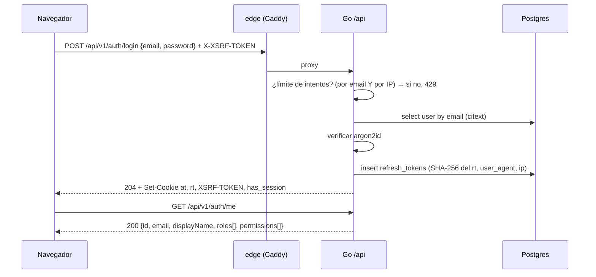
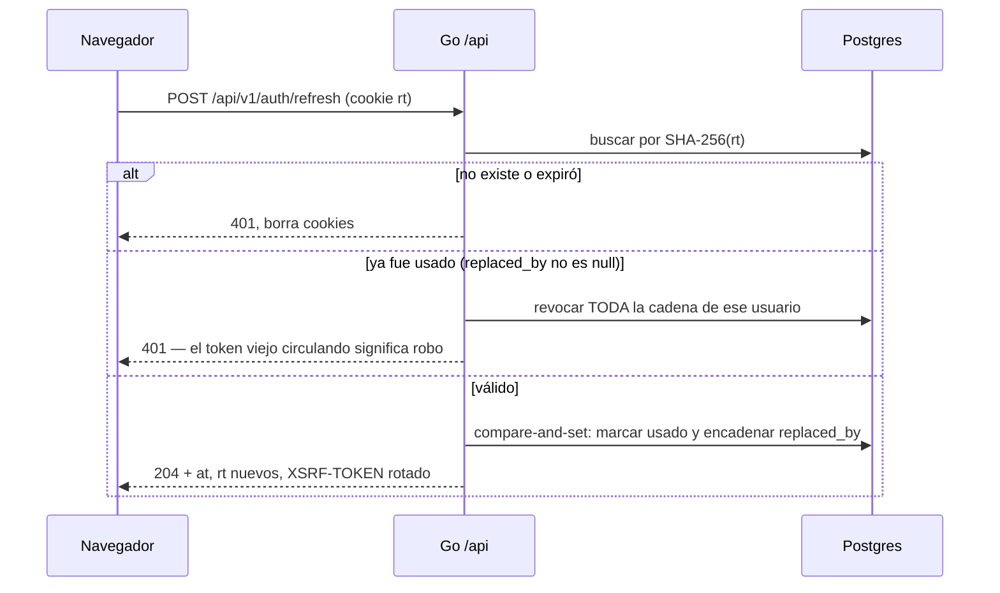
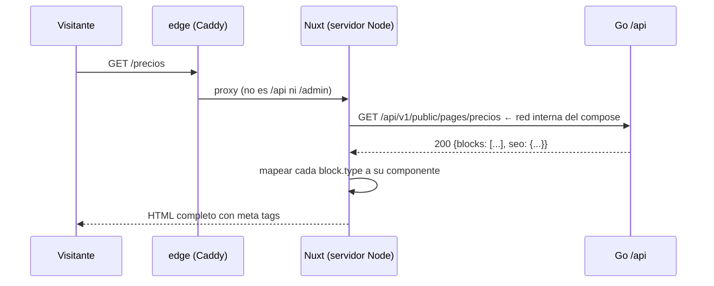
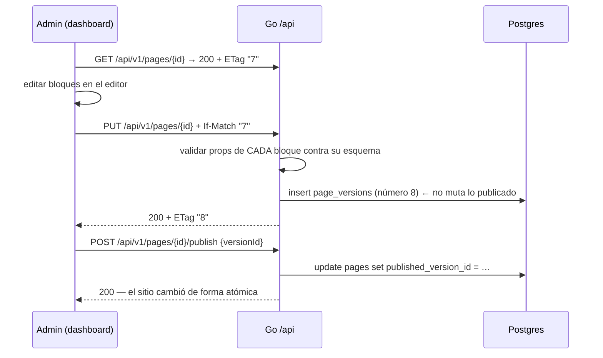
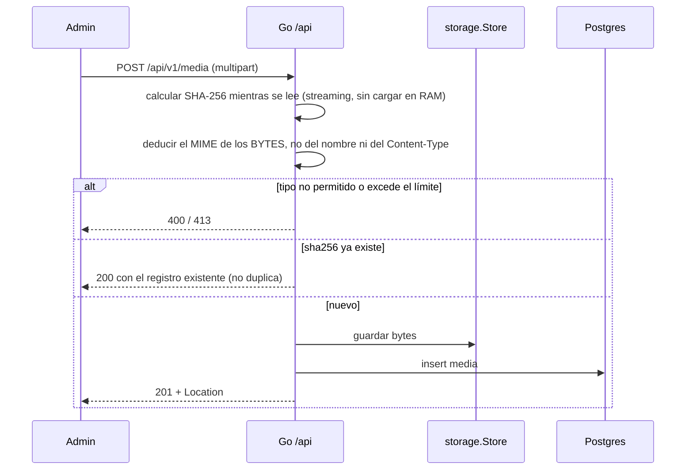

# 06 · Flujos

Los cinco recorridos que hay que entender antes de tocar auth, contenido o SSR.

---

## 1. Iniciar sesión



- Email inexistente y contraseña incorrecta responden **idéntico**. Distinguirlos
  convierte el login en un oráculo de qué correos están registrados
- El límite se evalúa **antes** de verificar la contraseña, para que un atacante
  no consuma tiempo de argon2
- El contador va por email **y** por IP, independientes. Solo por IP se saltea
  con NAT; solo por email deja bloquear a un tercero a voluntad
- Cuenta deshabilitada responde el mismo `401` genérico y no emite cookies

---

## 2. Renovar la sesión, con rotación y detección de robo



- **`replaced_by` es lo que convierte la rotación en detección.** Sin él, rotar
  solo acorta la vida útil del token robado; con él, el uso del token viejo
  delata al ladrón y cae la sesión entera
- La carrera (dos pestañas refrescando a la vez) la cierra un *compare-and-set*
  en SQL, no un bloqueo en Go: dos procesos no comparten memoria, pero sí base
- **Exclusión obligatoria:** el interceptor del cliente **no** debe reintentar
  `/auth/refresh`. Si el `401` del refresh vuelve a entrar al interceptor, este
  se encuentra su propia promesa en vuelo y se pone a esperarla: el síntoma no
  es un bucle, es **una petición que nunca vuelve**

---

## 3. Renderizar la landing (SSR)



Tres trampas de este flujo, todas caras:

- **La URL que usa el servidor no es la que usa el navegador.** Desde el
  contenedor de Nuxt, `http://go-starter.localhost` no existe: hay que pegarle
  a `http://api:8080` por la red interna. Dos variables, `apiInternal` y
  `apiPublic`, y usar la correcta según dónde corre el código. El síntoma de
  equivocarse es un `ECONNREFUSED` solo en SSR, que en desarrollo se ve como
  "la página en blanco al recargar, pero bien al navegar"
- **Las cookies no viajan solas en SSR.** El `fetch` del servidor no es el
  navegador: si una ruta renderizada en servidor necesita sesión, hay que
  reenviar la cabecera `cookie` explícitamente. Por eso `/admin` es SPA — no
  necesita este reenvío en absoluto
- **Un `block.type` desconocido no puede tumbar la página.** El registro de
  bloques resuelve lo que no conoce a un componente vacío y lo registra. Un
  fork que borra un tipo de bloque no debe romper páginas viejas que lo usan

---

## 4. Editar y publicar una página



- **Guardar y publicar son dos acciones distintas.** Guardar crea una versión;
  publicar apunta a una. Quien edita puede guardar sin permiso de publicar
- **La validación de bloques ocurre al guardar, no al publicar.** Si esperas a
  publicar, el editor deja construir durante media hora algo que va a rebotar
- **Revertir es publicar una versión anterior.** No hay lógica de deshacer, y
  por eso no hay bugs de deshacer
- Con `If-Match` viejo → `409`. Dos personas editando la misma página se
  enteran; sin esto, la última en guardar borra el trabajo de la otra en silencio

---

## 5. Subir una imagen



- **El tipo sale de los bytes.** Confiar en la extensión o en el `Content-Type`
  del cliente es cómo un `.php` termina llamándose `.jpg`
- **Streaming, no `io.ReadAll`.** Un archivo de 200 MB en memoria son 200 MB de
  memoria, multiplicados por peticiones concurrentes
- **El límite se aplica mientras se lee** (`http.MaxBytesReader`), no después.
  Comprobarlo al final significa haber aceptado ya todo el cuerpo
- El `413` de una subida grande a veces llega al cliente como un error de red y
  no como un código: el servidor tendría que tragarse el resto del cuerpo para
  poder contestar, y por encima de cierto tamaño corta la conexión

---

## 6. Qué le pasa a cada petición

```
petición
  → traceId          (genera o propaga; entra al contexto y al log)
  → recover          (un pánico responde 500 genérico, no tumba el proceso)
  → logger           (método, ruta, estado, duración, traceId)
  → CORS/CSRF        (mutaciones exigen X-XSRF-TOKEN)
  → sesión           (cookie at → Actor en el contexto; sin cookie, anónimo)
  → rate limit       (por IP; más estricto en /auth)
  → router           (resuelve el módulo y su handler)
  → guard            (permiso declarado en la ruta; sin política declarada, cierra)
  → handler → service → repo
```

El orden importa: `traceId` va primero porque todo lo demás lo registra, y
`recover` va antes que el logger para que un pánico también quede registrado.
El guard va **después** del router porque la política se declara en la ruta.
